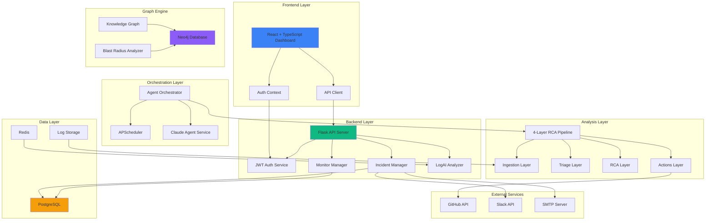
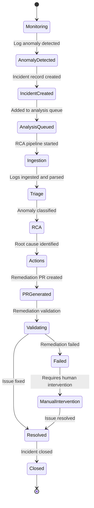
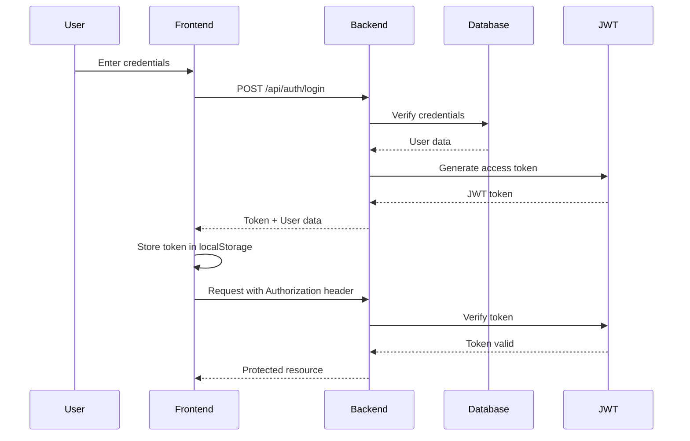
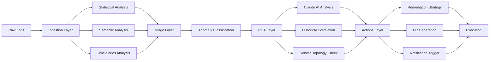
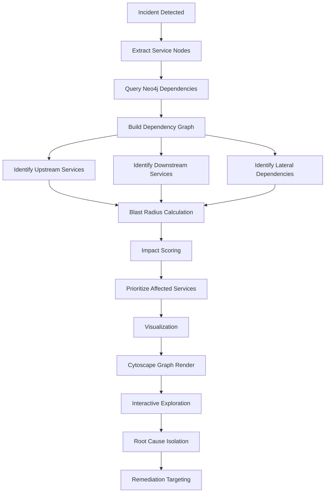
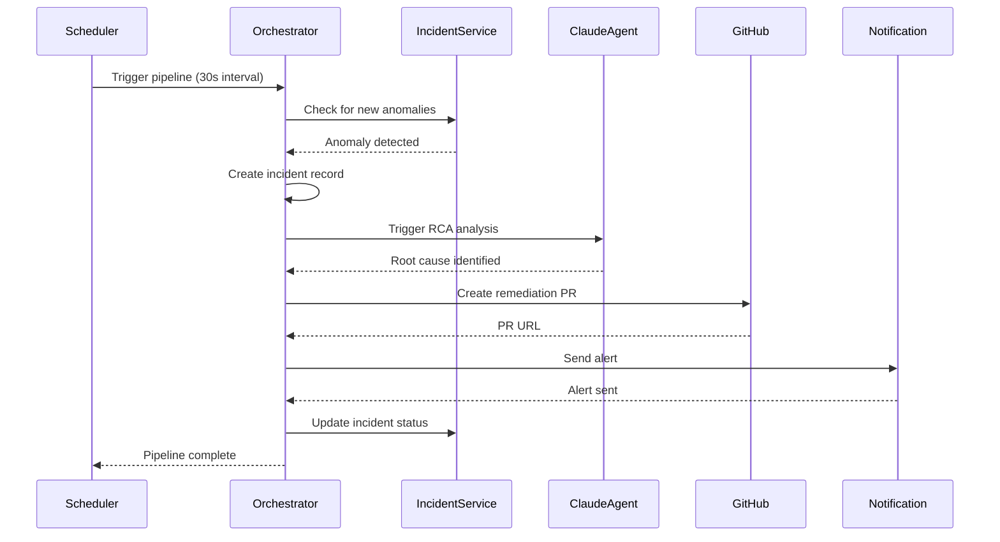

# Morphic AI

<div align="center">


**Self-Healing AI Incident Intelligence Platform**

Morphic autonomously detects, analyzes, visualizes, and remediates production incidents using AI-powered workflows.

[Features](#core-features) • [Architecture](#system-architecture) • [Setup](#setup-instructions) • [API](#api-documentation) • [Contributing](#contributors)

</div>

---

## Project Overview

Morphic is an enterprise-grade AI-powered observability and incident management platform that enables autonomous incident detection, root cause analysis, and self-healing remediation in production environments. By combining distributed tracing, knowledge graph visualization, and AI agent orchestration, Morphic reduces mean-time-to-resolution (MTTR) from hours to minutes.

### Key Capabilities

- **Autonomous Incident Detection**: Real-time log monitoring with AI-powered anomaly detection
- **Root Cause Analysis**: Multi-layered RCA pipeline using Claude AI for intelligent analysis
- **Knowledge Graph Visualization**: Neo4j-powered blast radius analysis and dependency mapping
- **Self-Healing Workflows**: Automated GitHub PR generation for incident remediation
- **Agent Orchestration**: Multi-agent system for coordinated incident response
- **Chaos Engineering**: Simulated failure scenarios for resilience testing

---

## Core Features

### AI-Powered Incident Detection

- **Real-time Log Ingestion**: Continuous monitoring of application logs with 30-second polling intervals
- **Statistical Anomaly Detection**: Statistical analysis for threshold-based anomaly identification
- **Semantic Analysis**: Natural language processing for log pattern recognition
- **Time-Series Analysis**: Temporal pattern detection for identifying anomalies over time

### Log Ingestion Pipeline

- **Multi-source Support**: Ingest logs from Docker containers, Kubernetes pods, and cloud services
- **Structured Parsing**: Automatic parsing of JSON, JSONL, and plain text log formats
- **Deduplication**: Intelligent log deduplication to reduce noise and storage
- **Buffering**: Redis-based buffering for high-throughput log streams

### Root Cause Analysis (RCA)

- **Multi-layered Analysis**: Combines statistical, semantic, and time-series analysis
- **Claude AI Integration**: Uses Claude 3.5 Sonnet for intelligent root cause identification
- **Context-Aware**: Incorporates service topology and historical incident data
- **Actionable Recommendations**: Generates specific remediation steps and suggested fixes

### Neo4j Knowledge Graph Visualization

- **Service Topology**: Visual representation of microservice dependencies
- **Blast Radius Analysis**: Identifies impact scope of failures across dependencies
- **Incident Correlation**: Links related incidents through common nodes
- **Temporal Graphing**: Time-based visualization of incident propagation

### Distributed Tracing

- **Trace ID Generation**: Automatic correlation of logs across services
- **Span Collection**: Captures request flow through distributed systems
- **Latency Analysis**: Identifies performance bottlenecks in request chains
- **Trace Aggregation**: Summarizes trace data for incident context

### Agent Orchestration

- **Multi-Agent System**: Coordinates specialized agents for different analysis tasks
- **Workflow Engine**: Executes incident response workflows with state management
- **Async Execution**: Non-blocking agent execution for parallel processing
- **Error Handling**: Graceful failure handling with fallback mechanisms

### Alert Channels

- **Email Notifications**: Configurable email alerts for incident stakeholders
- **Slack Integration**: Real-time Slack notifications for incident updates
- **Webhook Support**: Generic webhook integration for custom alert routing
- **Severity-based Routing**: Different alert channels based on incident severity

### GitHub PR Remediation Generation

- **Automated PR Creation**: Auto-generates pull requests with remediation code
- **Code Review Integration**: PRs include context and explanation of changes
- **Branch Strategy**: Configurable branch naming and target selection
- **PR Status Tracking**: Monitors PR status and completion

### Self-Healing Workflows

- **Automated Remediation**: Executes predefined remediation scripts
- **Rollback Support**: Automatic rollback if remediation fails
- **Validation**: Post-remediation validation to confirm issue resolution
- **Audit Trail**: Complete audit trail of all self-healing actions

### Chaos Engineering Simulation

- **Failure Injection**: Simulated failures for resilience testing
- **Scenario Library**: Pre-built chaos scenarios for common failure modes
- **Impact Analysis**: Measures system response to injected failures
- **Recovery Testing**: Validates self-healing capabilities

### JWT Authentication

- **Secure Token Generation**: JWT-based authentication with bcrypt password hashing
- **Token Refresh**: Automatic token refresh for seamless session management
- **Protected Routes**: Route-level protection for sensitive endpoints
- **Role-based Access**: Support for user roles and permissions

### Real-time Monitoring

- **30-second Polling**: Configurable polling interval for log monitoring
- **Live Dashboard**: Real-time view of system health and active incidents
- **Metrics Collection**: Custom metrics for operational insights
- **Alert Thresholds**: Configurable thresholds for proactive alerting

### AI-Driven Remediation

- **Claude Agent Integration**: Uses Claude AI for intelligent remediation decisions
- **Context-Aware Actions**: Remediation actions based on incident context
- **Learning from History**: Improves remediation suggestions over time
- **Human-in-the-Loop**: Optional human approval before automated actions

---

## System Architecture



---

## Flowcharts

### Incident Lifecycle



### Authentication Flow



### AI RCA Pipeline



### Knowledge Graph Flow



### Agent Orchestration Flow



---

## AI Pipeline Explanation

Morphic implements a sophisticated 4-layer AI pipeline for incident analysis:

### 1. Ingestion Layer
- **Purpose**: Collect and normalize log data from multiple sources
- **Process**: 
  - Log tailing from Docker/Kubernetes
  - Structured parsing (JSON, JSONL, plain text)
  - Deduplication and buffering
  - Trace ID assignment for correlation
- **Output**: Normalized log entries with metadata

### 2. Triage Layer
- **Purpose**: Classify and prioritize anomalies
- **Process**:
  - Statistical anomaly detection (Z-score, IQR)
  - Semantic pattern recognition (NLP)
  - Time-series pattern analysis
  - Severity scoring (CRITICAL, HIGH, MEDIUM, LOW)
- **Output**: Classified anomalies with severity levels

### 3. RCA Layer
- **Purpose**: Identify root cause and generate remediation strategy
- **Process**:
  - Claude AI analysis of error patterns
  - Historical incident correlation
  - Service topology analysis
  - Blast radius calculation
- **Output**: Root cause report with actionable recommendations

### 4. Actions Layer
- **Purpose**: Execute remediation and notify stakeholders
- **Process**:
  - GitHub PR generation with remediation code
  - Automated remediation script execution
  - Multi-channel notifications (Email, Slack, Webhooks)
  - Audit trail logging
- **Output**: Executed remediation with status tracking

---

## Knowledge Graph Architecture

Morphic leverages Neo4j to build a dynamic knowledge graph of service dependencies and incident relationships:

### Graph Schema

**Node Types:**
- `Service`: Represents microservices or applications
- `Incident`: Represents detected incidents
- `LogEntry`: Represents individual log entries
- `Trace`: Represents distributed trace spans
- `Alert`: Represents generated alerts

**Relationship Types:**
- `DEPENDS_ON`: Service-to-service dependencies
- `CAUSED`: Incident-to-service causality
- `CONTAINS`: Incident-to-log entries
- `CORRELATED`: Incident-to-incident relationships
- `TRIGGERED`: Alert-to-incident relationships

### Blast Radius Analysis

The blast radius analyzer uses graph algorithms to:

1. **Identify Upstream Dependencies**: Services that the affected service depends on
2. **Identify Downstream Dependencies**: Services that depend on the affected service
3. **Calculate Impact Score**: Weighted score based on dependency depth and criticality
4. **Visualize Impact**: Interactive graph visualization using Cytoscape.js

### Visualization Features

- **Interactive Graph**: Pan, zoom, and node selection
- **Color Coding**: Severity-based node coloring
- **Edge Labels**: Relationship types and metadata
- **Temporal Views**: Time-based graph snapshots
- **Filtering**: Filter by service type, severity, or time range

---

## Folder Structure

```
morphic/
├── backend/                      # Flask backend API
│   ├── agents/                   # AI agent implementations
│   │   ├── orchestrator.py       # Main orchestration logic
│   │   └── claude_agent.py       # Claude AI integration
│   ├── config/                   # Configuration management
│   │   └── settings.py           # Application settings
│   ├── db/                       # Database connection modules
│   │   ├── postgres.py           # PostgreSQL connection
│   │   ├── redis.py              # Redis connection
│   │   └── neo4j.py              # Neo4j connection
│   ├── models/                   # Data models
│   │   ├── database.py           # Database manager
│   │   ├── incident.py           # Incident model
│   │   ├── monitor.py            # Monitor model
│   │   └── user.py               # User model (auth)
│   ├── routes/                   # API route handlers
│   │   ├── auth.py               # Authentication routes
│   │   ├── incidents.py          # Incident routes
│   │   ├── monitors.py           # Monitor routes
│   │   ├── analyze.py            # Analysis routes
│   │   ├── health.py             # Health check routes
│   │   └── notifications.py      # Notification routes
│   ├── services/                 # Business logic
│   │   ├── auth_service.py       # Authentication service
│   │   ├── log_analysis.py       # LogAI analysis service
│   │   ├── monitor_checker.py    # Monitor checking service
│   │   ├── incident_service.py   # Incident management service
│   │   └── notifications.py      # Notification service
│   ├── middleware/               # Middleware
│   │   └── auth_middleware.py    # Authentication middleware
│   ├── utils/                    # Utility functions
│   │   └── logger.py             # Logging configuration
│   ├── app.py                    # Flask application entry point
│   ├── requirements.txt          # Python dependencies
│   └── init-db.sql               # Database initialization
│
├── frontend/                     # React + TypeScript frontend
│   ├── src/
│   │   ├── api/                  # API client
│   │   │   └── client.ts         # Axios client configuration
│   │   ├── components/           # React components
│   │   │   ├── morphic/          # Morphic-specific components
│   │   │   │   ├── AppShell.tsx  # Main application shell
│   │   │   │   └── ...
│   │   │   └── ...
│   │   ├── contexts/             # React contexts
│   │   │   └── AuthContext.tsx   # Authentication context
│   │   ├── pages/                # Page components
│   │   │   ├── Dashboard.tsx     # Main dashboard
│   │   │   ├── Incidents.tsx     # Incidents page
│   │   │   └── ...
│   │   └── ...
│   ├── package.json              # Node dependencies
│   └── tsconfig.json             # TypeScript configuration
│
├── landing-page/                 # Marketing landing page
│   ├── src/
│   │   ├── components/           # Landing page components
│   │   ├── pages/                # Auth pages
│   │   │   ├── Login.tsx         # Login page
│   │   │   └── Signup.tsx        # Signup page
│   │   ├── contexts/             # Context providers
│   │   │   └── AuthContext.tsx   # Auth context
│   │   └── App.tsx               # Main app component
│   ├── public/                   # Static assets
│   │   └── logo.png              # Morphic logo
│   ├── package.json              # Node dependencies
│   └── vite.config.ts            # Vite configuration
│
├── docker-compose.yml            # Docker Compose configuration
├── .env.example                  # Environment variables template
└── README.md                     # This file
```

---

## Setup Instructions

### Prerequisites

- Python 3.14+
- Node.js 18+
- Docker & Docker Compose
- PostgreSQL 14+
- Redis 7+
- Neo4j 5.x
- GitHub account (for PR remediation)
- Claude AI API key

### Cloning the Repository

```bash
git clone https://github.com/morphic/morphic.git
cd morphic
```

### Docker Setup (Recommended)

```bash
# Start all services
docker-compose up -d

# Check service status
docker-compose ps

# View logs
docker-compose logs -f
```

### Backend Setup

```bash
cd backend

# Create virtual environment
python -m venv venv
source venv/bin/activate  # On Windows: venv\Scripts\activate

# Install dependencies
pip install -r requirements.txt

# Set up environment variables
cp .env.example .env
# Edit .env with your configuration

# Initialize database
psql -U morphic_user -d morphic_db -f init-db.sql

# Start the server
python app.py
```

### Frontend Setup

```bash
cd frontend

# Install dependencies
npm install

# Set up environment variables
cp .env.example .env.local
# Edit .env.local with your configuration

# Start development server
npm run dev
```

### Landing Page Setup

```bash
cd landing-page

# Install dependencies
npm install

# Start development server
npm run dev
```

### Environment Variables

Create a `.env` file in the backend directory:

```env
# Database Configuration
POSTGRES_HOST=localhost
POSTGRES_PORT=5432
POSTGRES_DB=morphic_db
POSTGRES_USER=morphic_user
POSTGRES_PASSWORD=your_password

# Redis Configuration
REDIS_HOST=localhost
REDIS_PORT=6379
REDIS_PASSWORD=

# Neo4j Configuration
NEO4J_URI=bolt://localhost:7687
NEO4J_USER=neo4j
NEO4J_PASSWORD=your_neo4j_password

# JWT Configuration
JWT_SECRET_KEY=your_secret_key_change_in_production
JWT_ACCESS_TOKEN_EXPIRE_MINUTES=30

# GitHub Configuration
GITHUB_TOKEN=your_github_token
GITHUB_OWNER=your_github_username
GITHUB_REPO=your_repository_name
GITHUB_BRANCH=main

# Claude AI Configuration
ANTHROPIC_API_KEY=your_claude_api_key

# Application Configuration
FLASK_DEBUG=True
FLASK_ENV=development
MONITOR_CHECK_INTERVAL=30
```

### Neo4j Setup

```bash
# Pull Neo4j Docker image
docker pull neo4j:5.26.0

# Run Neo4j container
docker run -d \
  --name neo4j \
  -p 7474:7474 -p 7687:7687 \
  -e NEO4J_AUTH=neo4j/your_password \
  neo4j:5.26.0

# Access Neo4j Browser
# Open http://localhost:7474
# Login with neo4j/your_password
```

### Redis Setup

```bash
# Pull Redis Docker image
docker pull redis:7

# Run Redis container
docker run -d \
  --name redis \
  -p 6379:6379 \
  redis:7
```

---

## Authentication Setup

Morphic implements JWT-based authentication with the following architecture:

### Authentication Flow

1. **Registration**: User creates account via `/api/auth/register`
2. **Login**: User authenticates via `/api/auth/login`
3. **Token Generation**: Server generates JWT access token
4. **Token Storage**: Client stores token in localStorage
5. **Protected Requests**: Client includes token in Authorization header
6. **Token Validation**: Server validates token on protected routes
7. **Token Refresh**: Optional token refresh for extended sessions

### Protected Routes

The following routes require authentication:

- `/api/auth/me` - Get current user
- `/api/dashboard` - Dashboard access
- `/api/incidents` - Incident management
- `/api/monitors` - Monitor management
- `/api/graph/*` - Graph visualization
- `/api/orchestrate` - Orchestration controls

### Authentication API

#### Register User
```http
POST /api/auth/register
Content-Type: application/json

{
  "email": "user@example.com",
  "username": "johndoe",
  "password": "secure_password",
  "full_name": "John Doe"
}
```

#### Login
```http
POST /api/auth/login
Content-Type: application/json

{
  "email": "user@example.com",
  "password": "secure_password"
}
```

Response:
```json
{
  "access_token": "eyJhbGciOiJIUzI1NiIsInR5cCI6IkpXVCJ9...",
  "token_type": "bearer",
  "user": {
    "id": 1,
    "email": "user@example.com",
    "username": "johndoe",
    "role": "user"
  }
}
```

#### Get Current User
```http
GET /api/auth/me
Authorization: Bearer <access_token>
```

#### Logout
```http
POST /api/auth/logout
Authorization: Bearer <access_token>
```

---

## API Documentation

### Authentication Endpoints

#### POST /api/auth/register
Register a new user account.

**Request Body:**
```json
{
  "email": "string",
  "username": "string",
  "password": "string",
  "full_name": "string (optional)"
}
```

**Response (201):**
```json
{
  "message": "User registered successfully",
  "user": {
    "id": 1,
    "email": "user@example.com",
    "username": "johndoe",
    "role": "user"
  }
}
```

#### POST /api/auth/login
Authenticate user and receive JWT token.

**Request Body:**
```json
{
  "email": "string",
  "password": "string"
}
```

**Response (200):**
```json
{
  "access_token": "string",
  "token_type": "bearer",
  "user": {
    "id": 1,
    "email": "user@example.com",
    "username": "johndoe",
    "role": "user"
  }
}
```

#### GET /api/auth/me
Get current authenticated user.

**Headers:**
```
Authorization: Bearer <token>
```

**Response (200):**
```json
{
  "id": 1,
  "email": "user@example.com",
  "username": "johndoe",
  "role": "user",
  "created_at": "2024-01-01T00:00:00Z"
}
```

### Incident Endpoints

#### GET /api/incidents
Retrieve all incidents.

**Query Parameters:**
- `status`: Filter by status (open, in_progress, resolved, closed)
- `severity`: Filter by severity (critical, high, medium, low)
- `limit`: Maximum number of results
- `offset`: Pagination offset

**Response (200):**
```json
{
  "incidents": [
    {
      "id": 1,
      "trace_id": "abc123",
      "status": "open",
      "severity": "high",
      "created_at": "2024-01-01T00:00:00Z",
      "rca": {
        "root_cause": "Database connection timeout",
        "suggested_fix": {
          "action": "Increase connection pool size",
          "code": "pool = create_pool(max_size=20)"
        }
      }
    }
  ],
  "total": 100,
  "limit": 10,
  "offset": 0
}
```

#### GET /api/incidents/:id
Retrieve specific incident details.

**Response (200):**
```json
{
  "id": 1,
  "trace_id": "abc123",
  "status": "open",
  "severity": "high",
  "service": "payment-service",
  "error_type": "DatabaseError",
  "logs": [...],
  "rca": {...},
  "actions": [...],
  "created_at": "2024-01-01T00:00:00Z"
}
```

#### POST /api/incidents/:id/actions/github-pr
Generate GitHub PR for incident remediation.

**Request Body:**
```json
{
  "branch": "fix/incident-1",
  "target_branch": "main"
}
```

**Response (200):**
```json
{
  "status": "created",
  "pr_url": "https://github.com/owner/repo/pull/123",
  "pr_number": 123
}
```

### Graph Endpoints

#### GET /api/graph/incidents
Retrieve incident knowledge graph.

**Query Parameters:**
- `incident_id`: Filter by specific incident
- `depth`: Graph traversal depth (default: 2)

**Response (200):**
```json
{
  "nodes": [
    {
      "id": "payment-service",
      "type": "service",
      "status": "affected",
      "properties": {...}
    }
  ],
  "edges": [
    {
      "source": "payment-service",
      "target": "database-service",
      "type": "DEPENDS_ON",
      "properties": {...}
    }
  ],
  "blast_radius": {
    "affected_services": ["payment-service", "checkout-service"],
    "impact_score": 0.85
  }
}
```

#### GET /api/graph/traces/:trace_id
Retrieve trace graph for specific trace ID.

**Response (200):**
```json
{
  "trace_id": "abc123",
  "nodes": [...],
  "edges": [...],
  "timeline": [...]
}
```

### Orchestration Endpoints

#### POST /api/orchestrate/trigger
Manual trigger of orchestration pipeline.

**Request Body:**
```json
{
  "monitor_id": 1,
  "trace_id": "abc123"
}
```

**Response (200):**
```json
{
  "status": "triggered",
  "pipeline_id": "pipeline-123",
  "estimated_completion": "2024-01-01T00:01:00Z"
}
```

#### GET /api/orchestrate/status/:pipeline_id
Get status of orchestration pipeline.

**Response (200):**
```json
{
  "pipeline_id": "pipeline-123",
  "status": "running",
  "current_stage": "rca",
  "progress": 50,
  "stages": [
    {"name": "ingestion", "status": "completed"},
    {"name": "triage", "status": "completed"},
    {"name": "rca", "status": "running"},
    {"name": "actions", "status": "pending"}
  ]
}
```

---

## Demo Workflow

### Step 1: Monitor Setup

1. Create a monitor for your service:
```bash
curl -X POST http://localhost:5000/api/monitors \
  -H "Authorization: Bearer <token>" \
  -H "Content-Type: application/json" \
  -d '{
    "service_name": "payment-service",
    "log_path": "/var/log/payment-service.log",
    "check_interval": 30
  }'
```

2. Configure GitHub integration:
```bash
curl -X POST http://localhost:5000/api/settings/github \
  -H "Authorization: Bearer <token>" \
  -H "Content-Type: application/json" \
  -d '{
    "owner": "your-org",
    "repo": "your-repo",
    "branch": "main",
    "token": "your_github_token"
  }'
```

### Step 2: Incident Detection

1. Morphic monitors logs every 30 seconds
2. Anomaly detected in payment-service logs
3. Incident automatically created:
```json
{
  "incident_id": 1,
  "trace_id": "abc123",
  "status": "open",
  "severity": "high"
}
```

### Step 3: AI Analysis

1. RCA pipeline triggered automatically
2. Claude AI analyzes error patterns
3. Root cause identified:
```json
{
  "root_cause": "Database connection pool exhaustion",
  "confidence": 0.92,
  "evidence": [...]
}
```

### Step 4: Remediation

1. GitHub PR automatically generated
2. PR includes:
   - Code fix
   - Explanation
   - Test cases
3. PR URL: `https://github.com/owner/repo/pull/123`

### Step 5: Notification

1. Stakeholders notified via Email/Slack
2. Dashboard updated with incident status
3. Blast radius visualization available

### Step 6: Resolution

1. PR reviewed and merged
2. Service automatically redeployed
3. Incident marked as resolved
4. Post-remediation validation passes

---

## Architecture Decisions

### Why Neo4j?

**Decision**: Neo4j as the graph database for knowledge graph visualization.

**Rationale**:
- **Native Graph Storage**: Optimized for graph traversals and relationship queries
- **Cypher Query Language**: Powerful graph query capabilities
- **Scalability**: Handles millions of nodes and edges efficiently
- **Blast Radius Analysis**: Efficient graph algorithms for impact analysis
- **Temporal Graphing**: Support for time-based graph operations

**Alternatives Considered**:
- PostgreSQL with graph extensions (less performant for complex traversals)
- ArangoDB (less mature ecosystem)
- Custom graph implementation (higher maintenance burden)

### Why Redis?

**Decision**: Redis for log buffering and caching.

**Rationale**:
- **In-Memory Performance**: Sub-millisecond latency for high-throughput scenarios
- **Pub/Sub**: Built-in pub/sub for real-time notifications
- **Data Structures**: Rich data structures (lists, sets, hashes) for log aggregation
- **Persistence**: Optional persistence for durability
- **Scalability**: Cluster support for horizontal scaling

**Alternatives Considered**:
- Memcached (no persistence, limited data structures)
- RabbitMQ (overkill for simple buffering)
- PostgreSQL (higher latency for high-frequency writes)

### Why AI Orchestration?

**Decision**: Multi-agent orchestration for incident response.

**Rationale**:
- **Specialization**: Different agents for different tasks (RCA, remediation, notification)
- **Parallel Processing**: Agents can work concurrently
- **Resilience**: Failure of one agent doesn't crash the system
- **Extensibility**: Easy to add new agents for new capabilities
- **State Management**: Clear state tracking for complex workflows

**Alternatives Considered**:
- Monolithic service (harder to maintain and extend)
- External workflow engines (e.g., Airflow - overkill for this use case)
- Event-driven architecture (increased complexity)

### Why Graph Visualization?

**Decision**: Interactive graph visualization for incident analysis.

**Rationale**:
- **Visual Context**: Humans understand relationships better visually
- **Blast Radius**: Clear visualization of impact scope
- **Pattern Recognition**: Visual patterns reveal hidden dependencies
- **Exploration**: Interactive exploration aids investigation
- **Communication**: Easy to communicate complex relationships

**Alternatives Considered**:
- Tabular data (harder to understand complex relationships)
- Textual reports (less intuitive for topology)
- Static diagrams (not interactive, hard to update)

---

## Future Improvements

### Short-term (Next 3 months)

- [ ] Multi-cloud log ingestion support (AWS, GCP, Azure)
- [ ] Advanced anomaly detection with ML models
- [ ] Custom alert routing rules
- [ ] Incident SLA tracking and reporting
- [ ] Mobile app for on-call engineers

### Medium-term (3-6 months)

- [ ] Automated rollback capabilities
- [ ] Incident prediction and prevention
- [ ] Integration with popular observability platforms (Datadog, New Relic)
- [ ] Custom agent marketplace
- [ ] Advanced RBAC and team management

### Long-term (6-12 months)

- [ ] Self-healing at infrastructure level (Kubernetes, Terraform)
- [ ] Cross-organization incident sharing (anonymized)
- [ ] AI-powered incident prediction models
- [ ] Enterprise SSO integration (SAML, OAuth 2.0)
- [ ] Global multi-region deployment

---

## Contributors

We welcome contributions from the community! Please see our [Contributing Guidelines](CONTRIBUTING.md) for details.

### Core Team

- **Lead Architect**: [Name]
- **Backend Lead**: [Name]
- **Frontend Lead**: [Name]
- **ML Engineer**: [Name]

### How to Contribute

1. Fork the repository
2. Create a feature branch (`git checkout -b feature/amazing-feature`)
3. Commit your changes (`git commit -m 'Add amazing feature'`)
4. Push to the branch (`git push origin feature/amazing-feature`)
5. Open a Pull Request

---

## License

This project is licensed under the MIT License - see the [LICENSE](LICENSE) file for details.

### MIT License

```
Copyright (c) 2024 Morphic AI

Permission is hereby granted, free of charge, to any person obtaining a copy
of this software and associated documentation files (the "Software"), to deal
in the Software without restriction, including without limitation the rights
to use, copy, modify, merge, publish, distribute, sublicense, and/or sell
copies of the Software, and to permit persons to whom the Software is
furnished to do so, subject to the following conditions:

The above copyright notice and this permission notice shall be included in all
copies or substantial portions of the Software.

THE SOFTWARE IS PROVIDED "AS IS", WITHOUT WARRANTY OF ANY KIND, EXPRESS OR
IMPLIED, INCLUDING BUT NOT LIMITED TO THE WARRANTIES OF MERCHANTABILITY,
FITNESS FOR A PARTICULAR PURPOSE AND NONINFRINGEMENT. IN NO EVENT SHALL THE
AUTHORS OR COPYRIGHT HOLDERS BE LIABLE FOR ANY CLAIM, DAMAGES OR OTHER
LIABILITY, WHETHER IN AN ACTION OF CONTRACT, TORT OR OTHERWISE, ARISING FROM,
OUT OF OR IN CONNECTION WITH THE SOFTWARE OR THE USE OR OTHER DEALINGS IN THE
SOFTWARE.
```

---

## Support

- **Documentation**: [docs.morphic.ai](https://docs.morphic.ai)
- **Issues**: [GitHub Issues](https://github.com/morphic/morphic/issues)
- **Discussions**: [GitHub Discussions](https://github.com/morphic/morphic/discussions)
- **Email**: support@morphic.ai

---

<div align="center">

**Built with ❤️ by the Morphic AI Team**

[Website](https://morphic.ai) • [Documentation](https://docs.morphic.ai) • [Blog](https://blog.morphic.ai)

</div>
